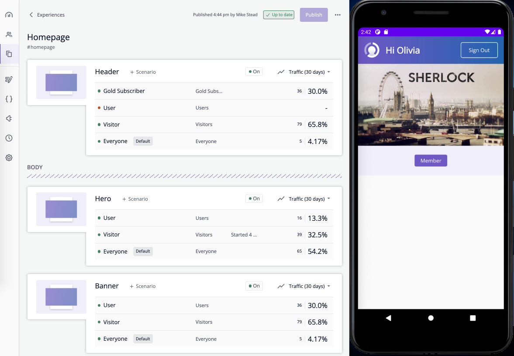

# mtribes samples - Android

The sample projects below show how `mtribes` can be integrated with various Android applications.
These samples demonstrate how to easily add targeting control into an existing app.

## Samples

- [RxJava2](https://github.com/ReactiveX/RxJava/tree/2.x) - a minimal Android example using the
  mtribes SDK
- [Coroutines Flow](https://kotlinlang.org/docs/reference/coroutines/flow.html#asynchronous-flow)(in
  progress) - a sample app where Flow is being used to consume the SDK

### Running

Clone the project and open it in Android Studio, then build and run the app on a simulator or device.

### Structure

Each sample contains the following files:

- `samples/data/FakeRepository.kt` - contains all data-related logic and mtribes-related integration code
- `samples/ui/MainViewModel.kt` - contains all presentation-related logic
- `mtribes` module - generated mtribes Space integration code
- `samples/ui/MainFragment.kt` - contains a simple UI layout

And the following UI elements:

1. `Header` - displays a sign-in/out button along with a welcome message when signed in
2. `Hero` - displays a different image depending on whether signed in or out
3. `Banner` - displays a `Join Now` label when signed out, and a `Member` label when signed in

`Hero` and `Banner` are moved into an mtribes `Section` to highlight the dynamic capabilities these
can provide.

#### mtribes Space with sample app

